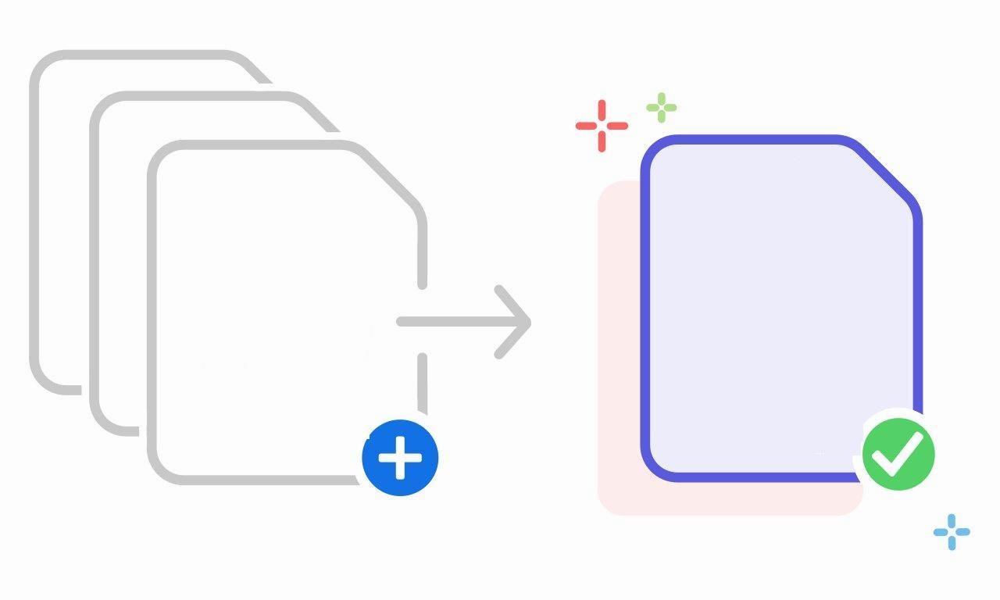

# goMerge
[](https://pkg.go.dev/github.com/Ja7ad/goMerge)

Merge some files in a path with custom extension in golang



## Feature
- Walk in a path with a goroutine using parallelism
- Merge files with custom extension
- Remove unmerged files with remove flag

## Install goMerge

`go get -u github.com/Ja7ad/goMerge`

## Example

```go
package main

import (
	fileMerger "github.com/Ja7ad/goMerge"
	"log"
)

func main() {
	err := fileMerger.Merge("./test", ".log", "./test/merged.txt", true)
	if err != nil {
		log.Fatal(err)
	}
}
```
